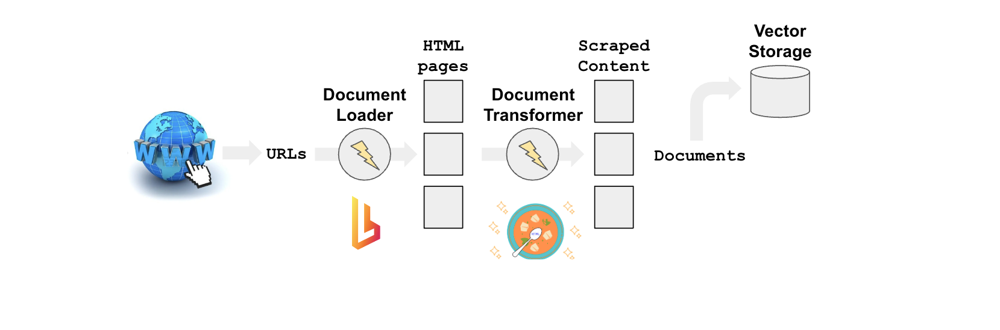
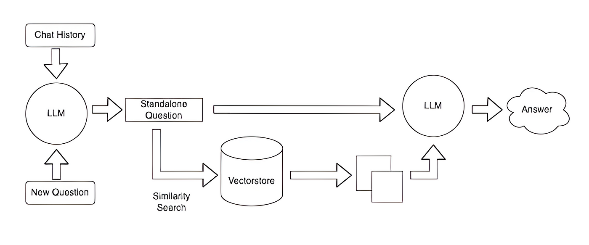
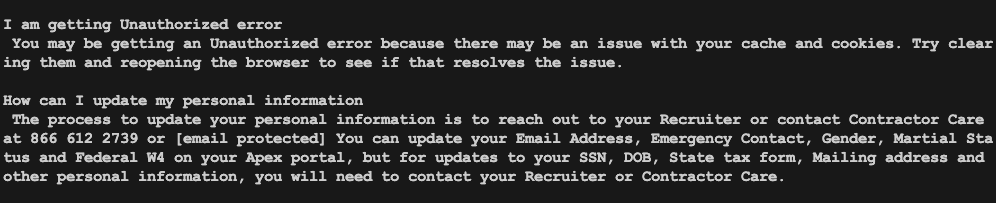
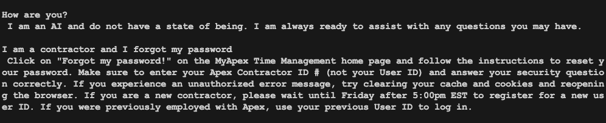

# Ask Apex

 **Ask Apex** is a chatbot, that works on scrapped data from knowledge based in http://support.apexsystemsinc.com/kb/index.php The Ask apex uses the following architecture to scrape and index data using pinecone as shown below.

For Summary, it uses OpenAI got 4 to summarize the results as shown below  



# How to use
## 1. <a name='Prerequisites'></a>Prerequisites


 1. Clone the repo and use the following command
 2. Set up OpenAI and PineCone account and get
	 - OPENAI_API_KEY
	 - PINECONE_API_KEY
	 - PINECONE_ENV
 3. Store the variable in  `.env` of your project
 4. Set your python environment and do
	```bash
	pip install .
	```


## 3. Output

Following screenshots shows the output of this RAG model, this model works fine. As the scrapped data is less and has only few documents, the retrieval and summary modules are working as expected. Need to test on more pages

Following screenshots shows the working



## 4. Roadmap

- [ ] Create metrics to measure hallucination, relevancy, toxicity and retrieval scores
- [ ] Design a Cloud Build CI/CD
- [ ] Initialize data on GCP Compute Engine
- [ ] Improve Retriever 
- [ ] Integrate the evaluation process directly in GCP
- [ ] Export the dashboard from LangSmith to monitor RAG process in GCP

